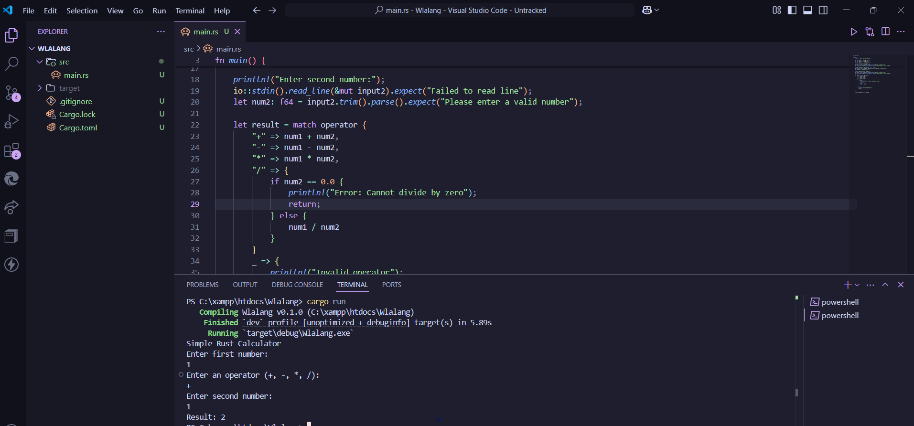

# 🧮 Rust CLI Calculator

A simple command-line calculator built using **Rust**. It performs basic arithmetic operations:

➕ Addition  
➖ Subtraction  
✖️ Multiplication  
➗ Division  

---
## 📸 Preview



---

## 🚀 Getting Started

### ✅ Prerequisites

Make sure **Rust** is installed on your machine.  
You can install it by running:

```bash
curl --proto '=https' --tlsv1.2 -sSf https://sh.rustup.rs | sh
🔗 Or visit: https://www.rust-lang.org/tools/install

🛠️ Setup Instructions
Navigate to your desired directory:

cd C:\xampp\htdocs
Create or enter your project folder:

mkdir Wlalang
cd Wlalang
Initialize a new Rust project:

cargo init

